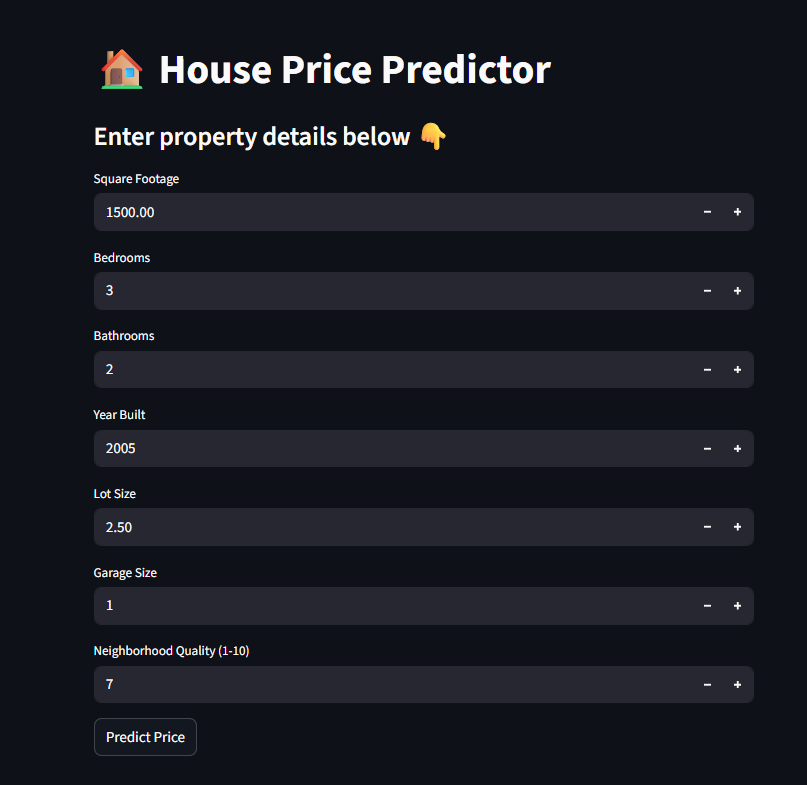
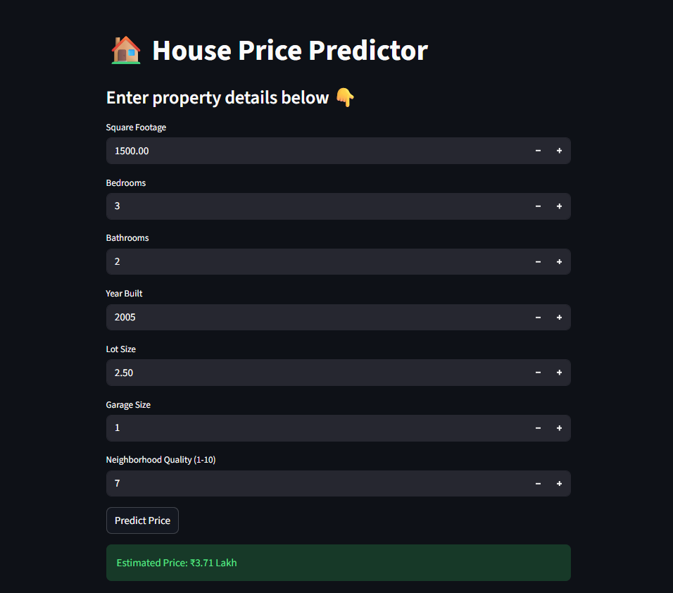

# House Price Predictor

A simple machine learning web app that estimates house prices from basic property details. It loads a pre-trained model and scaler, takes user inputs through a lightweight UI, and returns a formatted price estimate.

## Features
- Interactive UI for entering property details
- Validates key inputs (year built, lot size)
- Scales inputs before prediction
- Outputs prices in readable Indian currency formats (₹, Lakh, Cr)
- Lightweight and beginner-friendly

## Tech Stack
- Frontend/UI: Streamlit
- ML: scikit-learn
- Backend/Runtime: Python
- Utilities: NumPy, Joblib
- Model Artifacts: model.pkl, scaler.pkl

## Project Structure
```
.
├── app.py              # Streamlit app entry point
├── requirements.txt    # Python dependencies
├── README.md           # Project documentation
```

## Installation Instructions
1. Clone the repository:
	```
	git clone <your-repo-url>
	cd house-price-predictor
	```
2. Create and activate a virtual environment (recommended):
	```
	python -m venv .venv
	.venv\Scripts\activate
	```
3. Install dependencies:
	```
	pip install -r requirements.txt
	```
4. Ensure model files exist in the project root:
	- model.pkl
	- scaler.pkl

## Usage Guide
Run the app locally:
```
streamlit run app.py
```

Then open the provided local URL in your browser, enter property details, and click Predict Price.

## API Endpoints
This project does not expose any HTTP API endpoints (UI-only app).

## Screenshots / Demo
Input Screen:


Prediction Result:



## Environment Variables
No environment variables are required for the current setup.

## Dependencies
From requirements.txt:
- gradio
- scikit-learn
- numpy
- joblib

Note: The app uses Streamlit in code. If running locally, install it as well:
```
pip install streamlit
```

## Future Improvements / Roadmap
- Add model training pipeline and dataset
- Add input validation ranges for all fields
- Deploy to Streamlit Cloud or similar
- Provide confidence intervals for predictions
- Add visualizations (feature impacts, price distribution)

## Contributing Guidelines
Contributions are welcome:
1. Fork the repo
2. Create a feature branch
3. Commit your changes
4. Open a pull request with a clear description

## License
MIT License

## About Me
Hi, I am Manish Kumar Singh. I enjoy building practical machine learning applications and clean, user-friendly data products.

Links:
- GitHub: https://github.com/Manishkumarsingh41
- Email: mailto:singhmanishofficial102@gmail.com

## Author
- Manish Kumar Singh